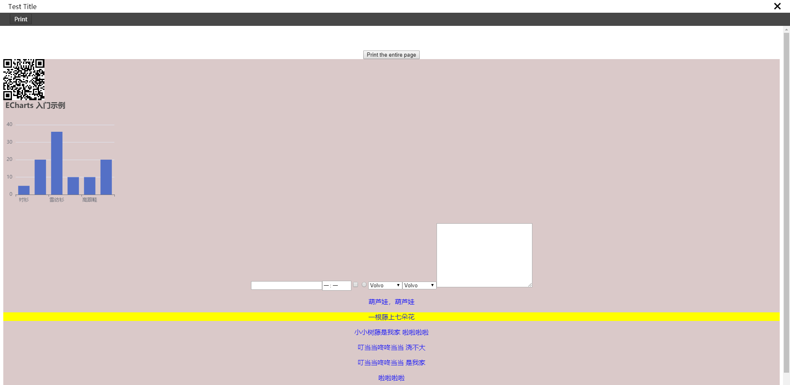
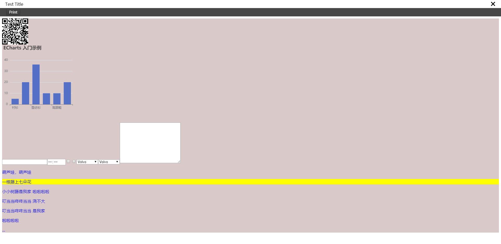

# vue-print-nb

This is a directive wrapper for printed, Simple, fast, convenient, light.
<!-- TOC -->

- [vue-print-nb](#vue-print-nb)
  - [Install](#install)
    - [Vue2 Version:](#vue2-version)
    - [Vue3 Version:](#vue3-version)
  - [Description](#description)
  - [Usage Method:](#usage-method)
    - [Print the entire page:](#print-the-entire-page)
    - [Print local range:](#print-local-range)
    - [Print local range More:](#print-local-range-more)
    - [Print URL:](#print-url)
    - [Print Preview](#print-preview)
      - [Print Url Preview:](#print-url-preview)
      - [Print local range Preview](#print-local-range-preview)
    - [Print Async Url](#print-async-url)
  - [v-print API](#v-print-api)

<!-- /TOC -->
## Install

[在线DEMO](https://power-kxlee.github.io/vue-print-nb/dist/index.html)

[ONLINE DEMO](https://power-kxlee.github.io/vue-print-nb/dist/index.html)

### Vue2 Version:
```bash
npm install vue-print-nb --save
```


```javascript
import Print from 'vue-print-nb'
// Global instruction 
Vue.use(Print);

//or

// Local instruction
import print from 'vue-print-nb'

directives: {
    print   
}

```
### Vue3 Version:
```bash
npm install vue3-print-nb --save
```

```javascript
// Global instruction 
import { createApp } from 'vue'
import App from './App.vue'
import print from 'vue3-print-nb'
const app = createApp(App)
app.use(print)
app.mount('#app')

//or

// Local instruction
import print from 'vue3-print-nb'

directives: {
    print   
}
```


## Description

Support two printing methods, direct printing page HTML, and printing URL

It's easy to use, Support Vue compatible browser version


## Usage Method:

### Print the entire page:

```
<button v-print>Print the entire page</button>
```


### Print local range:

HTML:
```
    <div id="printMe" style="background:red;">
        <p>葫芦娃，葫芦娃</p>
        <p>一根藤上七朵花 </p>
        <p>小小树藤是我家 啦啦啦啦 </p>
        <p>叮当当咚咚当当　浇不大</p>
        <p> 叮当当咚咚当当 是我家</p>
        <p> 啦啦啦啦</p>
        <p>...</p>
    </div>

    <button v-print="'#printMe'">Print local range</button>
```
Pass in a string type directly
* `id`: ID of local print range

### Print local range More:
HTML:
```
 <button v-print="printObj">Print local range</button><div id="loading" v-show="printLoading"></div>
 
  <div id="printMe" style="background:red;">
        <p>葫芦娃，葫芦娃</p>
        <p>一根藤上七朵花 </p>
        <p>小小树藤是我家 啦啦啦啦 </p>
        <p>叮当当咚咚当当　浇不大</p>
        <p> 叮当当咚咚当当 是我家</p>
        <p> 啦啦啦啦</p>
        <p>...</p>
    </div>
```
JavaScript:
```
export default {
    data() {
        return {
           printLoading: true,
            printObj: {
              id: "printMe",
              popTitle: 'good print',
              extraCss: "https://cdn.bootcdn.net/ajax/libs/animate.css/4.1.1/animate.compat.css, https://cdn.bootcdn.net/ajax/libs/hover.css/2.3.1/css/hover-min.css",
              extraHead: '<meta http-equiv="Content-Language"content="zh-cn"/>',
              beforeOpenCallback (vue) {
                vue.printLoading = true
                console.log('打开之前')
              },
              openCallback (vue) {
                vue.printLoading = false
                console.log('执行了打印')
              },
              closeCallback (vue) {
                console.log('关闭了打印工具')
              }
            }
        };
    }
}
```
You can also pass in an object type `Object`


### Print URL:

If you need to print the specified URL, you can use the following method:
(Ensure that your URL is the same source policy)

HTML:
```
 <button v-print="printObj">Print local range</button>
```

JavaScript:
```
export default {
    data() {
        return {
            printObj: {
              url: 'http://localhost:8080/'
              beforeOpenCallback (vue) {
                console.log('打开之前')
              },
              openCallback (vue) {
                console.log('执行了打印')
              },
              closeCallback (vue) {
                console.log('关闭了打印工具')
              }
            }
        };
    }
}
```

### Print Preview
Support print preview, pass in` preview:true `, All printing methods are supported

#### Print Url Preview:

HTML:
```
 <button v-print="printObj">Print local range</button>
```

JavaScript:
```
export default {
    data() {
        return {
            
            printObj: {
              url: 'http://localhost:8080/'
              preview: true,
              previewTitle: 'Test Title', // The title of the preview window. The default is 打印预览
              previewBeforeOpenCallback (vue) {
                console.log('正在加载预览窗口')
              },
              previewOpenCallback (vue) {
                console.log('已经加载完预览窗口')
              },
              beforeOpenCallback (vue) {
                console.log('打开之前')
              },
              openCallback (vue) {
                console.log('执行了打印')
              },
              closeCallback (vue) {
                console.log('关闭了打印工具')
              }
            }
        };
    }
}
```



#### Print local range Preview
HTML:
```
 <button v-print="printObj">Print local range</button><div id="loading" v-show="printLoading"></div>
 
  <div id="printMe" style="background:red;">
        <p>葫芦娃，葫芦娃</p>
        <p>一根藤上七朵花 </p>
        <p>小小树藤是我家 啦啦啦啦 </p>
        <p>叮当当咚咚当当　浇不大</p>
        <p> 叮当当咚咚当当 是我家</p>
        <p> 啦啦啦啦</p>
        <p>...</p>
    </div>
```
JavaScript:
```
export default {
    data() {
        return {
           printLoading: true,
            printObj: {
              id: "printMe",
              preview: true,
              previewTitle: 'print Title', // The title of the preview window. The default is 打印预览
              popTitle: 'good print',
              extraCss: "https://cdn.bootcdn.net/ajax/libs/animate.css/4.1.1/animate.compat.css, https://cdn.bootcdn.net/ajax/libs/hover.css/2.3.1/css/hover-min.css",
              extraHead: '<meta http-equiv="Content-Language"content="zh-cn"/>',
              previewBeforeOpenCallback (vue) {
                console.log('正在加载预览窗口')
              },
              previewOpenCallback (vue) {
                console.log('已经加载完预览窗口')
              },
              beforeOpenCallback (vue) {
                vue.printLoading = true
                console.log('打开之前')
              },
              openCallback (vue) {
                vue.printLoading = false
                console.log('执行了打印')
              },
              closeCallback (vue) {
                console.log('关闭了打印工具')
              }
            }
        };
    }
}
```



### Print Async Url

Perhaps, your URL is obtained asynchronously. You can use the following method

HTML:
```
 <button v-print="printObj">Print local range</button>
```

JavaScript:
```
export default {
    data() {
        return {
            printObj: {
              asyncUrl (reslove, vue) {
                setTimeout(() => {
                  reslove('http://localhost:8080/')
                }, 2000)
              },
              previewBeforeOpenCallback (vue) {
                console.log('正在加载预览窗口')
              },
              previewOpenCallback (vue) {
                console.log('已经加载完预览窗口')
              },
              beforeOpenCallback (vue) {
                console.log('打开之前')
              },
              openCallback (vue) {
                console.log('执行了打印')
              },
              closeCallback (vue) {
                console.log('关闭了打印工具')
              }
            }
        };
    }
}
```
Finally, use `reslove()` to return your URL


## v-print API

| Parame                    | Explain                                                                                                 | Type          | OptionalValue                                     | DefaultValue |
| ------------------------- | ------------------------------------------------------------------------------------------------------- | ------------- | ------------------------------------------------- | ------------ |
| id                        | Range print ID, required value                                                                          | String        | —                                                 | —            |
| standard                  | Document type (Print local range only)                                                                  | String        | html5/loose/strict                                | html5        |
| extraHead                 | `<head></head>`Add DOM nodes in the node, and separate multiple nodes with `,` (Print local range only) | String        | —                                                 | —            |
| extraCss                  | `<link>` New CSS style sheet , and separate multiple nodes with `,`(Print local range only)             | String        | —                                                 | -            |
| popTitle                  | `<title></title>` Content of label (Print local range only)                                             | String        | —                                                 | -            |
| openCallback              | Call the successful callback function of the printing tool                                              | Function      | Returns the instance of `Vue` called at that time | -            |
| closeCallback             | Close the callback function of printing tool success                                                    | Function      | Returns the instance of `Vue` called at that time | -            |
| beforeOpenCallback        | Callback function before calling printing tool                                                          | Function      | Returns the instance of `Vue` called at that time | -            |
| url                       | Print the specified URL. (It is not allowed to set the ID at the same time)                             | string        | -                                                 | -            |
| asyncUrl                  | Return URL through 'resolve()' and Vue                                                                  | Function      | -                                                 | -            |
| preview                   | Preview tool                                                                                            | Boolean       | -                                                 | false        |
| previewTitle              | Preview tool Title                                                                                      | String        | -                                                 | '打印预览'   |
| previewPrintBtnLabel      | The name of the preview tool button                                                                     | String        | -                                                 | '打印'       |
| zIndex                    | CSS of preview tool: z-index                                                                            | String,Number | -                                                 | 20002        |
| previewBeforeOpenCallback | Callback function before starting preview tool                                                          | Function      | Returns the instance of `Vue`                     | -            |
| previewOpenCallback       | Callback function after fully opening preview tool                                                      | Function      | Returns the instance of `Vue`                     | -            |
| clickMounted       | Click the callback function of the print button                                                    | Function      | Returns the instance of `Vue`                     | -            |


License：

[MIT](http://opensource.org/licenses/MIT)
